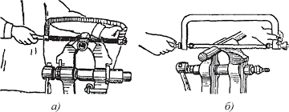

<html>
    <head>
        <title>Слесарьтехника</title>
    </head>
    <body>
        
Тема 4: Резка металла 

        
         <a href="https://artsiom-zhuk369.github.io/program/">вернутся на главную страницу</a>
         
Резка - операция по отделению частей от сортового либо листого металла. Резка отличается от рубки тем, что ударные усилия заменяются нагрузками. 
        Ручную ножовку применяют для разрезания листов, полосового круглого и профильного металла, прорезания пазов, обрезки и вырезки заготовок по контуру и. д. 
        Ручная слесарная ножовка состоит из станка, рукоятки и ножовочного полотна. Полотно вставляют концами в прорези подвижной и неподвижной головок, после чего закрепляют штифтами и натягивают винтом  
        с барашковой гайкой. Ножовочные рамки изготавливают цельными и раздвижными. 
        Шаг Р зубьев ножовочного полотна - расстояние между двуми смежными зубьями шагом завсит от свойств разрезаемого металла. 
         Чтобы избежать заедания ножовочного полотна в металле, зубья разводят. Существуют два способа разводки:1)по полотну - когда полотно изгибается так, чтобы образовать волны с шагом 8Р; 
          2) по зубу - разводятся в равные стороны только зубья и не затргивается полотно. Разводка по полотну применяется для полотен с шагом до 0.8мм разводка по зубу - для полотен с шагом более 0.8мм. 
          Основные причины брака при резке - косой рез металла, несоблюдение заданных размеров в результате неправильной разметки или разрезания не по риске, повреждение разрезаемой заготовки из-за неправильного зажима в тисках и др. 
          При работе на дисковых ножницах ножи-диски должны быть ограждены специальными щитками, препятствующими поподанию пальцев рабочего под ножи. 
          приступая к работе на разрезаных станках, необходимо ознакомиться с иснтрукцией по безопасности труда и строго соблюдать ее в процессе работы на данном оборудывании. 
          
  

  
    </body>
</html>
